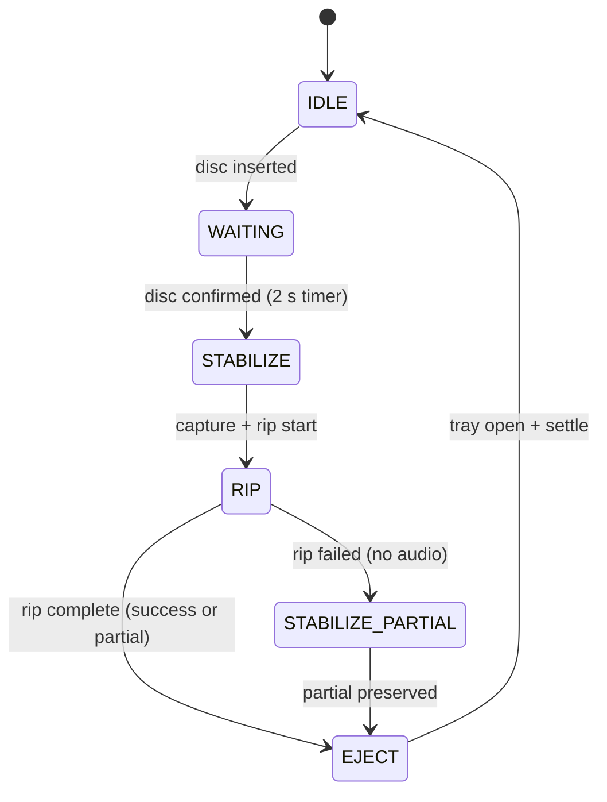

# ARCHITECTURE.md

> Current as of sprint-8 (2026-05-17). Updated per-sprint per the doc
> cadence in `docs/WORKFLOW.md` §5. For the disc-to-library workflow as
> a Mermaid diagram, see `docs/WORKFLOW-DIAGRAM.md`.

---

## Topology

One machine does everything. The CM4 owns the optical drive (`/dev/sr0`),
the USB webcam (`/dev/video0`), the Tasmota LED panel (`192.168.5.186`),
storage, and the FastAPI review surface.

```
CM4 (192.168.6.38 / cda.mattmariani.com)
│
├── cd-archivist daemon  (systemd user service, port 8228)
│   ├── State machine loop   — poll drive, advance states, orchestrate rip
│   ├── FastAPI / uvicorn    — kanban UI + REST API
│   └── python -m archivist  — entrypoint (loop + uvicorn in one process)
│
├── Docker compose stack
│   ├── beets                — audio tagging + MusicBrainz import
│   ├── navidrome            — music server (scans /srv/music/library hourly)
│   └── jellyfin             — alternate music/video server (shared mount)
│
├── /srv/music/              — canonical storage root (ARCHIVIST_DISCS_ROOT)
│   ├── inbox/               — rip in progress (.ripping/ during active rip)
│   ├── review/              — needs operator attention
│   ├── library/             — clean imports, Navidrome-visible
│   ├── archive/             — out-of-rotation but kept
│   └── failed/              — bad rips preserved for salvage
│
└── /home/mmariani/Projects/cd-archivist/   — repo + venv
```

The daemon is deployed via `git pull` + `pip install -e '.[dev]'` +
`systemctl --user restart cd-archivist`. See `docs/WORKFLOW.md` §4 for
the full deploy sequence.

---

## Component map

### `archivist/drivers/`

Hardware-facing primitives. Each module wraps one physical resource and
raises or returns sentinel values on failure — never crashes the loop.

| Module             | What it wraps                                                                 |
| ------------------ | ----------------------------------------------------------------------------- |
| `drive.py`         | `read_drive_status` — ioctl CDROM_DRIVE_STATUS → open / no_disc / tray_open  |
| `camera.py`        | `capture_frame` — ffmpeg subprocess → JPEG at path; returns `None` on failure |
| `led.py`           | `LEDPanel` — Tasmota HTTP API (`power_on` / `power_off` / `status`)           |
| `ripper.py`        | `CDAudioRipper` — cdparanoia rip + flac encoding; `RipResult(status, tracks, errors)` |
| `disc_id.py`       | `read_disc_id` — libdiscid TOC hash; returns `(disc_id, freedb_id)` or `None` |
| `rip_log.py`       | Streams cdparanoia stderr; feeds `parse_cdparanoia_progress`                  |
| `usb_discovery.py` | `discover_camera_usb_path` — resolves v4l2 device from vendor:product at startup |
| `systemctl.py`     | `stop_unit` / `start_unit` — systemd user-unit control (future use)           |

### `archivist/pipeline/`

Orchestration functions that compose drivers into named pipeline steps.
Pure transformations where possible; all file I/O is explicit.

| Module             | What it does                                                                       |
| ------------------ | ---------------------------------------------------------------------------------- |
| `capture.py`       | `capture_disc` — LED dance + burst captures → `CaptureRecord`; `copy_canonical_photo` |
| `rip.py`           | `rip_disc` → `RipRecord`; `cleanup_wavs`; `rename_tracks_to_canonical`            |
| `disc_id.py`       | `next_disc_id` — lockfile-guarded unique ID reservation                            |
| `folder_name.py`   | `next_disc_folder_name` — `YYYY-MM-DD_HHMM_disc-NNNNNN` naming + collision guard  |
| `folder.py`        | `prepare_disc_folder` — mkdir `audio/ captures/ logs/ review/`; idempotent         |
| `pairing.py`       | `make_pairing` / `attach_pairing` — join capture session to rip by session ID      |
| `source_json.py`   | `build_source_json` — assembles `source.json` from disc context                    |
| `post_rip_hook.py` | `run_process_ready_hook` — invokes beets via docker exec after a successful rip    |
| `rip_progress.py`  | `parse_cdparanoia_progress` — parses cdparanoia stderr → `RipProgress`             |
| `review_capture.py`| `recapture_review` — mid-review photo retake (LED + camera, no rip)               |

### `archivist/state_machine/`

The poll-driven loop and drive-status snapshot.

| Module             | What it does                                                                  |
| ------------------ | ----------------------------------------------------------------------------- |
| `loop.py`          | `ArchivistLoop` — `tick()` advances one state per call; `run()` drives it     |
| `drive_status.py`  | `DriveStatus` dataclass + `update_from_progress_line` — live rip progress     |

### `archivist/service/`

FastAPI surface: routes, HTML rendering, and supporting helpers.

| Module                | What it does                                                                 |
| --------------------- | ---------------------------------------------------------------------------- |
| `app.py`              | `create_app` — wires all routes; main HTML + API surface                     |
| `disc_card_builder.py`| `build_kanban_state` — walks `music_root/` buckets → `KanbanState`           |
| `kanban_page.py`      | Renders the 4-column kanban HTML (Mash Co. design system)                    |
| `mb_client.py`        | MusicBrainz direct queries via `musicbrainzngs` (candidates endpoint)        |
| `operator_hints.py`   | `PATCH /api/disc/{folder}/hints` — persists operator-supplied ID hints       |
| `beets_review.py`     | Beets candidate apply / use-as-is review flow                                |
| `damaged_disc.py`     | Process-partial / redo / rerip-tracks actions                                |
| `review_explainer.py` | Generates the human-readable "why it's in review" string                     |
| `review_page_v1.py`   | `/review` HTML list + detail pages (legacy; kanban is the primary surface)   |
| `library.py`          | `/library` HTML list + detail pages + asset serving                          |
| `track_identification.py` | `identified_tracks()` — stubbed; returns `set()` per D-track-identification-source |
| `json_highlight.py`   | Syntax-highlights `source.json` for the drawer card-detail view              |
| `status_line.py`      | Formats per-card status line (e.g. `ripping track 7 · sector 24,318`)        |

### `archivist/models/`

Pydantic v2 schemas with `extra="forbid"` throughout.

| Module          | What it models                                                            |
| --------------- | ------------------------------------------------------------------------- |
| `source.py`     | `SourceJson` — primary per-disc record (sprint-4+). See Data model below. |
| `manifest.py`   | `Manifest` v0.2 — legacy schema for pre-sprint-4 `CD_NNNN/manifest.json` |

---

## Data model

### `source.json` — primary disc record (sprint-4+)

Every disc folder written after sprint-4 contains a `source.json`. The
schema is Pydantic-enforced; reads and writes are atomic (`.tmp` +
`os.replace`).

```
SourceJson
├── schema_version: 1
├── ripper: Ripper (name, version, host)
├── disc: Disc (folder_name, disc_counter, inserted_at, rip_started_at,
│             rip_finished_at, ejected_at, ready_at, timezone)
├── drive: Drive (device, model, serial, read_offset)
├── audio: Audio (format, sample_rate_hz, bits_per_sample, channels,
│              track_count, total_duration_seconds, secure_rip,
│              accuraterip_verified)
├── identifiers: Identifiers (musicbrainz_disc_id, freedb_disc_id,
│                             cd_toc, upc, isrcs)
├── detected_metadata: DetectedMetadata (album_artist, album, year,
│                       label, catalog_number, tracks: [DetectedTrack])
├── physical_disc: PhysicalDisc (photo, photo_captured, photo_device,
│                  label_text_guess, appears_burned, handwritten)
├── files: [FileEntry] (path, kind, size_bytes, sha256)
├── status: Status (rip_success, photo_success, ready, warnings, errors,
│           partial, failed_tracks, beets_review_reason)
├── operator_hints: OperatorHints (various_artists, burned_cd, artist,
│                    album, tracks: [TrackHint])
└── provenance: [ProvenanceEntry] (attempt_id, tracks, started_at, ended_at)
```

### On-disk disc folder layout

```
/srv/music/{inbox,review,library,archive,failed}/
    <folder_name>/              e.g. 2026-05-15_1423_disc-000018/
        source.json             primary record
        audio/
            01 Track.flac
            02 Track.flac
            ...
        captures/
            disc_front_ambient_001.jpg
            disc_front_lit_001.jpg
            disc_front_lit_002.jpg   ← canonical (preferred)
        logs/
            rip.log
        review/
            (beets candidate files, operator notes)
```

Legacy folders written before sprint-4 use `CD_NNNN/manifest.json`
(the `Manifest` v0.2 schema). The kanban reads both; new folders always
get `source.json`.

---

## Pipeline state machine

```
IDLE
 │  tray opens / disc inserted
 ▼
WAITING
 │  disc detected (2s stabilize timer)
 ▼
STABILIZE──────────────────────────────────┐
 │  camera burst + cdparanoia rip starts   │ failure (no WAVs or FLAC error)
 ▼                                         ▼
RIP                               STABILIZE_PARTIAL
 │  flac encoding + disc-id +              │ partial rip preserved in
 │  post_rip_hook                          │ inbox/ with status.partial=True
 ▼                                         │
EJECT ←────────────────────────────────────┘
 │  drive.eject(); tray opens; LED off
 ▼
IDLE
```

Mermaid `stateDiagram-v2` rendering:



The loop runs as a daemon thread (`run(loop, poll_interval=2.0)`); each
`tick()` advances at most one state. The capture LED dance runs inside
the STABILIZE→RIP transition. The `post_rip_hook` fires on a successful
or partial rip and invokes beets via docker exec.

---

## Beets integration

Beets runs in a Docker container on the CM4. The daemon communicates with
it via `docker exec`. After a successful rip, `post_rip_hook.py` calls:

```bash
docker exec cd_beets beet import --quiet <disc_folder>
```

The hook's result (auto-applied or routed to review) is recorded in
`source.json.status.beets_review_reason`.

For the candidates UI (sprint-5 / sprint-7):

1. **disc-id lookup** — `libdiscid` computes the MusicBrainz disc ID
   from the TOC. `mb_client.py` queries `musicbrainzngs` directly
   (per `D-mb-query-direct-not-beets`).
2. **AcoustID fingerprint fallback** — if disc-id returns no match,
   AcoustID audio fingerprint is computed and queried.
3. **Candidates ranked** by score; top 5 surfaced in the UI. Selecting
   one POSTs to `accept-top-candidate` which triggers `beet import
   --mbid <mbid>`.

Operator hints (`OperatorHints`) feed into beets search but are not yet
wired end-to-end (sprint-8 open issue).

---

## API surface

All routes registered in `archivist/service/app.py::create_app`.

### Kanban + disc actions

| Method | Path                                   | Returns              | Notes                              |
| ------ | -------------------------------------- | -------------------- | ---------------------------------- |
| GET    | `/`                                    | HTML                 | 4-column kanban page               |
| GET    | `/api/kanban`                          | JSON `KanbanState`   | Full board state; polls 1s/5s      |
| GET    | `/api/status`                          | JSON `LoopState`     | Legacy status endpoint             |
| GET    | `/api/rig/stats`                       | JSON                 | Discs ripped / in review / partial / storage / uptime |
| GET    | `/api/drive/status`                    | JSON `DriveStatus`   | Live rip progress snapshot         |
| GET    | `/api/disc/{folder}/candidates`        | JSON                 | MusicBrainz candidates (ranked)    |
| POST   | `/api/disc/{folder}/accept-top-candidate` | JSON              | Apply chosen candidate via beets   |
| GET    | `/api/disc/{folder}/log/tail`          | JSON                 | Per-disc rip log tail              |

### Logs

| Method | Path                   | Returns     | Notes                          |
| ------ | ---------------------- | ----------- | ------------------------------ |
| GET    | `/api/log`             | text/plain  | Daemon log tail (cap 1000)     |
| GET    | `/api/logs/tail`       | JSON        | Structured log tail with limit |

### Control

| Method | Path                       | Returns | Notes                     |
| ------ | -------------------------- | ------- | ------------------------- |
| POST   | `/api/control/mode`        | JSON    | Set loop mode             |
| POST   | `/api/control/start-rip`   | JSON    | Trigger rip (manual mode) |
| POST   | `/api/control/eject`       | JSON    | Eject drive               |
| POST   | `/api/control/capture`     | JSON    | Trigger capture           |
| POST   | `/api/control/reset`       | JSON    | Reset loop state          |

### Review (legacy `/review` surface)

| Method | Path                                    | Returns | Notes                        |
| ------ | --------------------------------------- | ------- | ---------------------------- |
| GET    | `/review`                               | HTML    | Review folder list           |
| GET    | `/review/{folder}`                      | HTML    | Review detail                |
| GET    | `/api/review/folders`                   | JSON    | Review folder list           |
| GET    | `/api/review/{folder}/candidates`       | JSON    | Beets candidates             |
| POST   | `/api/review/{folder}/apply`            | JSON    | Apply beets candidate        |
| POST   | `/api/review/{folder}/use-as-is`        | JSON    | Accept without tagging       |
| GET    | `/api/review/{folder}/audio/{filename}` | audio   | Serve audio file             |

### Library

| Method | Path                                      | Returns | Notes                            |
| ------ | ----------------------------------------- | ------- | -------------------------------- |
| GET    | `/library`                                | HTML    | Library list (filter by status)  |
| GET    | `/library/{disc_id}`                      | HTML    | Library detail                   |
| GET    | `/library/{disc_id}/album-cover`          | image   | Album art                        |
| GET    | `/library/{disc_id}/captures/{filename}`  | image   | Capture photo                    |
| GET    | `/library/{disc_id}/audio/{filename}`     | audio   | Audio file                       |
| GET    | `/library/{disc_id}/photo`                | image   | Canonical disc photo             |
| GET    | `/library/{disc_id}/review/{filename}`    | file    | Review asset                     |
| POST   | `/api/library/{disc_id}/recapture`        | JSON    | Trigger post-import recapture    |

---

## Decision provenance

Key architectural decisions are recorded in sprint coord docs under
`## Decision Log`. The most load-bearing ones:

| Decision ID                         | Sprint | Summary                                                           |
| ----------------------------------- | ------ | ----------------------------------------------------------------- |
| `D-port-8228`                       | 2      | Daemon listens on 8228; avoids conflicts with common dev ports    |
| `D-eject-time-capture`              | 3      | Camera fires POST-EJECT so disc face is visible (not in tray)     |
| `D-review-recapture-mvp`            | 3      | Operator can retake disc photo mid-review without re-ripping      |
| `D-source-json-v1`                  | 4      | `source.json` is the primary per-disc record; `manifest.json` is legacy |
| `D-mb-query-direct-not-beets`       | 5      | musicbrainzngs direct queries for candidates; beets for import only |
| `D-cdplay-decouple-not-install`     | 6      | `cdplay.service` not required; removed from the rip loop          |
| `D-live-update-transport-v1`        | 6      | Kanban polls `/api/kanban` (1s ripping / 5s idle); no websockets  |
| `D-candidates-source-priority`      | 7      | disc-id lookup first; AcoustID fingerprint as fallback             |
| `D-track-identification-source`     | 7      | `identified_tracks()` stubbed pending real data source            |
| `D-housekeeping-no-code-changes`    | 8      | Sprint-8 is docs + tree cleanup only; no `archivist/` touches     |
| `D-trunk-based-default`             | 8      | Stay on `master` trunk until v1.0; document branch thresholds     |

Full decision text lives in `docs/coordination/sprint-N.md` `## Decision Log` sections.
