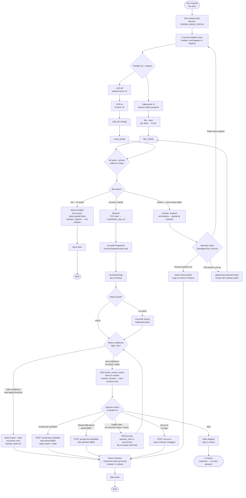
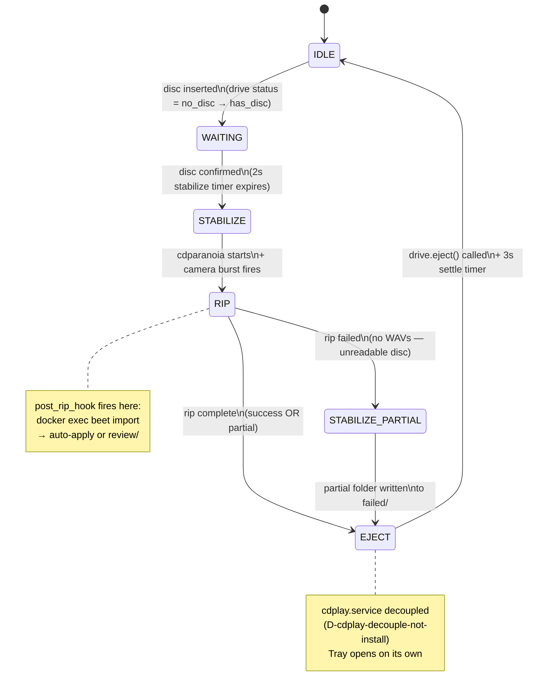

# WORKFLOW-DIAGRAM.md

> Mermaid diagrams of the disc-to-library pipeline. For the component
> map and data model, see `docs/ARCHITECTURE.md`. For commit/deploy
> workflow, see `docs/WORKFLOW.md`.

---

## Disc-to-library pipeline

---

## State machine

---

## Kanban UI surface annotations

Each state machine transition corresponds to a column or visual change
in the kanban at `cda.mattmariani.com`:

| State / Event                     | Kanban surface                                             |
| --------------------------------- | ---------------------------------------------------------- |
| STABILIZE → RIP                   | Card appears in **Capture** column; per-track bar starts filling |
| Active rip in progress            | Poll interval drops to 1 s; header shows "ripping · DISC-XXXX" |
| RIP complete — auto-apply         | Card moves to **Beets ID** column (briefly) → **In Library** |
| RIP complete — routed to review   | Card moves to **Review** column with reason chip           |
| Partial rip                       | Card stays in **Capture** with red-shadow treatment; 3 action buttons appear |
| Card clicked                      | Inline expansion with Hints / Manual Steps / Damaged-Disc sections |
| Drawer open — no card selected    | Right-side drawer shows live drive status (track / sector / retries / elapsed) |
| Drawer open — card selected       | Right-side drawer shows rip-log tail + source.json highlight + disc photo |
| Disc in library                   | Card in **In Library**; album art replaces disc-photo placeholder |
| Idle                              | Poll interval rises to 5 s; header shows "idle"            |
